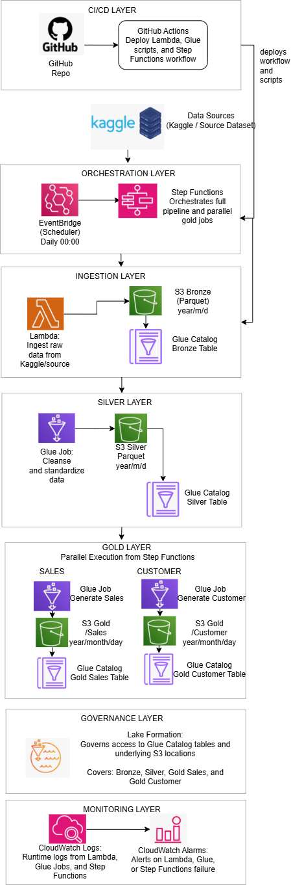

# HEMA Retail Sales Technical Assignment - Meadows Olusesi

## Overview
In this repo, I implemented a data pipeline for HEMA's retail sales assignment that follows a medallion structure (Bronze, Silver, and Gold) on AWS infrastructure.

## Architecture

The solution implements a scalable, maintainable data pipeline using AWS services:
- **AWS S3**: Data lake storage (Bronze, Silver, Gold layers)
- **AWS Glue**: ETL processing and Data Catalog management
- **AWS Lambda**: Lightweight transformations and orchestration triggers
- **AWS Step Functions**: Orchestration of the daily batch workflow
- **AWS CloudWatch**: Logging and monitoring
- **AWS Lake Formation**: Access governance

### Pipeline Architecture

*Figure 1: Data Pipeline Architecture - Medallion structure with Bronze, Silver, and Gold layers*

## Implementation Approach

### Dual Code Base: PySpark (AWS Glue) + Pandas (Local Testing)

This project provides:

**PySpark Scripts** (for AWS Glue Jobs):
- `src/silver/cleanse_data_pyspark.py` - Distributed data cleansing
- `src/gold/generate_sales_pyspark.py` - PySpark transformations for Sales
- `src/gold/generate_customer_pyspark.py` - PySpark aggregations for Customer
- Uses: Glue DynamicFrames, Spark DataFrames, window functions
- **Deploy these to AWS Glue** for production

**Pandas Scripts** (for Local Development):
- `src/silver/cleanse_data.py` - Local cleansing logic
- `src/gold/generate_sales.py` - Local Sales generation
- `src/gold/generate_customer.py` - Local Customer metrics
- Uses: Pandas DataFrames, local file I/O
- **Run these locally** for development/testing

## Running the Pipeline

### Local Development
```bash
# Run bronze layer
python src/bronze/ingest_raw_data.py

# Run silver layer
python src/silver/cleanse_data.py

# Run gold layer - Sales
python src/gold/generate_sales.py

# Run gold layer - Customer
python src/gold/generate_customer.py
```

### AWS Deployment
The pipeline is orchestrated via AWS Step Functions for daily batch execution:
1. Bronze ingestion triggered at 00:00 UTC
2. Silver transformation executes after bronze completion
3. Gold datasets generated after silver completion
4. CloudWatch logs track all executions


## Pipeline Execution Results

### Bronze Layer
- **Status**: Success 
- **Records Processed**: 9,800
- **Execution Time**: 47.44 seconds
- **Output Path**: `data/bronze/retail_sales`

### Silver Layer
- **Status**: Success 
- **Records Input**: 9,800
- **Records Output**: 9,800
- **Execution Time**: 95.71 seconds
- **Output Path**: `data/silver/retail_sales`

### Gold Layer - Sales Dataset
- **Status**: Success 
- **Records Output**: 4,922 unique orders
- **Execution Time**: 69.53 seconds
- **Output Path**: `data/gold/sales`
- **Columns**: order_id, order_date, shipment_date, shipment_mode, city

### Gold Layer - Customer Dataset
- **Status**: Success 
- **Records Output**: 793 unique customers
- **Execution Time**: 16.35 seconds
- **Output Path**: `data/gold/customer`
- **Columns**: customer_id, customer_first_name, customer_last_name, customer_segment, country, orders_last_month, orders_last_6_months, orders_total

## Testing

All 32 unit tests passing:

```bash
pytest tests/ -v
```

- **Bronze Layer**: 4 tests
- **Silver Layer**: Data cleansing and validation
- **Gold Sales**: 6 tests (schema, deduplication, transformations)
- **Gold Customer**: 9 tests (metrics calculation, name parsing, data quality)
- **Utils**: 13 tests (partitioning, logging, configuration)
